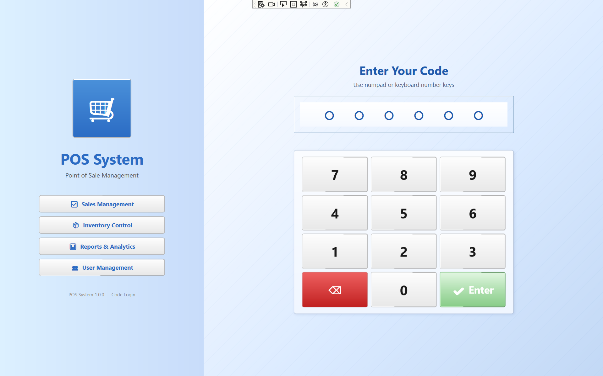
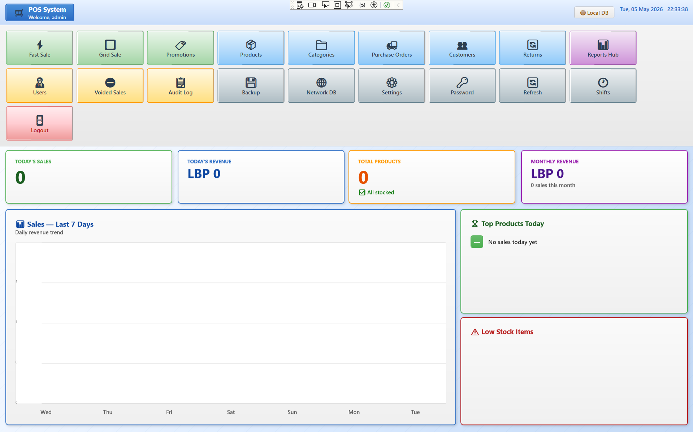
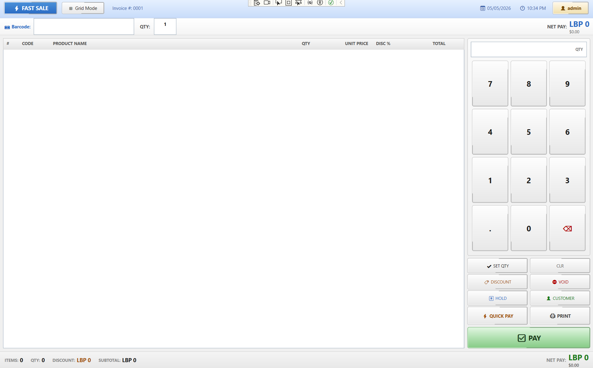
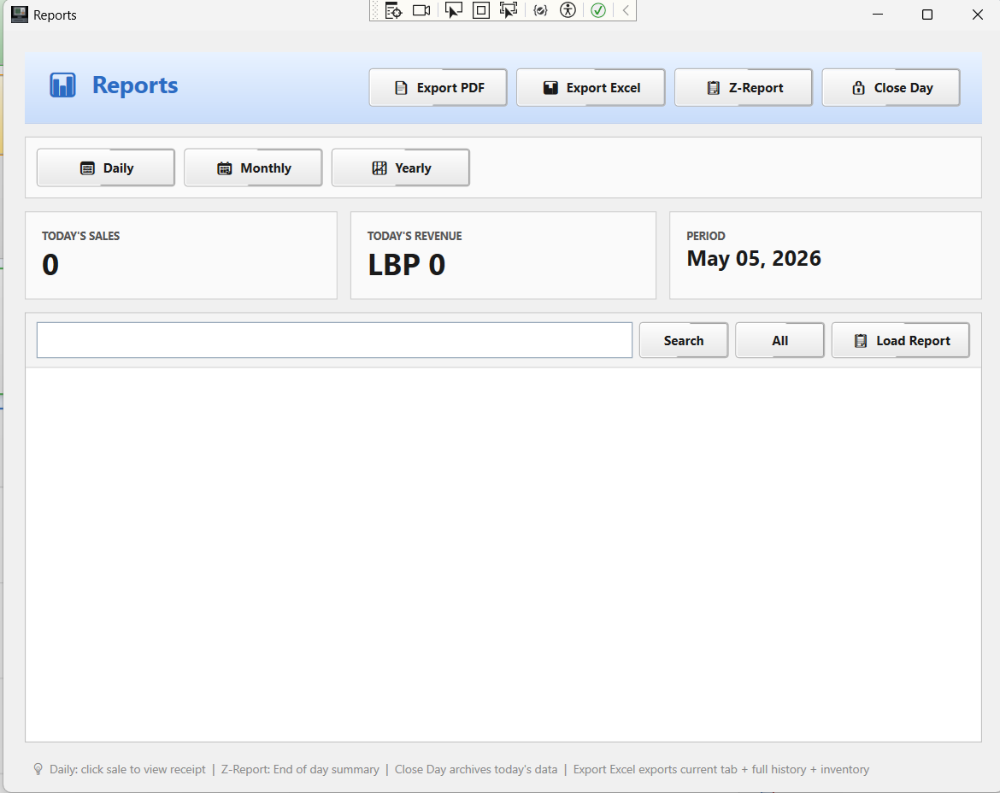

<div align="center">

# 🛒 POS System (C# WPF)

A **professional-grade Point of Sale system** designed for **Lebanese retail businesses**, supporting **dual-currency operations (LBP / USD)** and complete store management workflows.

---


</div>

---

## 🎥 Demo Preview

> *(Add a short screen recording GIF here for better presentation impact)*


---

## 📌 Overview

This POS system simulates a **real-world retail environment**, covering all essential business operations:

- Sales processing (barcode + cart system)
- Inventory management with stock control
- Customer tracking system
- Promotions and discounts engine
- Financial reporting and analytics
- Secure role-based authentication

It is optimized for **real business usage in Lebanon**, where **dual-currency handling (LBP / USD)** is required in daily operations.

---

## 🇱🇧 Why This Project Matters

Retail businesses in Lebanon often face:

- 💱 Constant currency fluctuations (LBP / USD)
- 🧾 Manual and error-prone stock management
- 📉 High cost of commercial POS systems
- 📊 Lack of structured reporting tools

### 💡 This system provides:

✔ Offline-first POS solution  
✔ Easy deployment for small and medium businesses  
✔ Accurate dual-currency handling  
✔ Business-grade reporting system  

---

## 🚀 Core Features

### 🛍️ Sales & Checkout System
- Barcode scanning & product search
- Fast cart-based checkout
- Real-time pricing updates

### 💵 Multi-Currency Payments
- LBP / USD support
- Cash, card, and mixed payments
- Automatic currency conversion handling

### 📦 Inventory Management
- Stock tracking system
- Batch & expiry date control
- Low-stock alerts

### 🎯 Promotions Engine
- Percentage discounts
- Fixed discounts
- Buy X Get Y offers (BOGO)

### 🎁 Loyalty System
- Customer points accumulation
- Reward system (points & stamps)

### 📊 Advanced Reporting
- Sales analytics dashboard
- Profit tracking
- Cashier performance reports
- Export to Excel (EPPlus)
- Export to PDF (PDFSharp)

### 🔐 Security & Roles
- Admin / Cashier role-based access
- Secure authentication system
- BCrypt password hashing

### 💾 Data Management
- Backup & restore system
- Lightweight SQLite database

---

## 🧠 Key Highlights

- 🇱🇧 Built specifically for **Lebanese retail workflows**
- ⚙️ Implements **real business logic (not a demo project)**
- 🧾 Fully functional end-to-end POS system
- 📊 Enterprise-level reporting structure
- 🔐 Secure role-based architecture
- 🧠 Designed with scalability in mind

---

## 🏗️ Tech Stack

| Layer | Technology |
|------|------------|
| Language | C# (.NET Framework) |
| UI | WPF (XAML) |
| Database | SQLite |
| Architecture | MVVM Pattern |
| Security | BCrypt |
| Reporting | EPPlus, PDFSharp |

---

## 🖥️ Screenshots

<div align="center">

### 🔐 Login


### 📊 Dashboard


### 🛒 POS Screen


### 📈 Reports


</div>

---

## ▶️ Getting Started

### 📥 Clone Repository

```bash
gh repo clone jadabousbeit23/retail-pos-system-csharp
